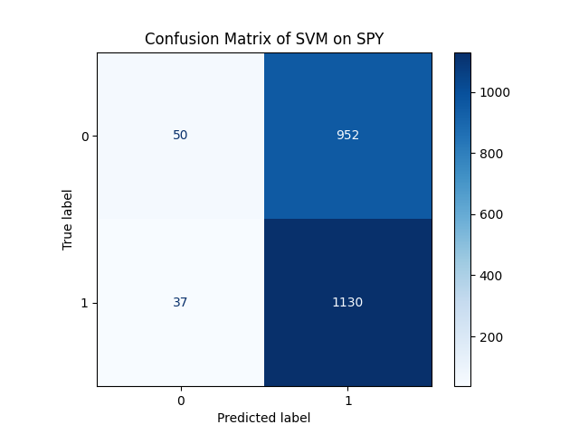
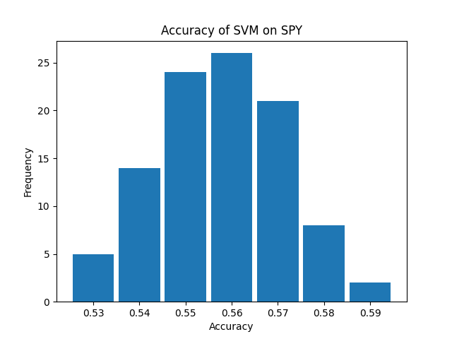
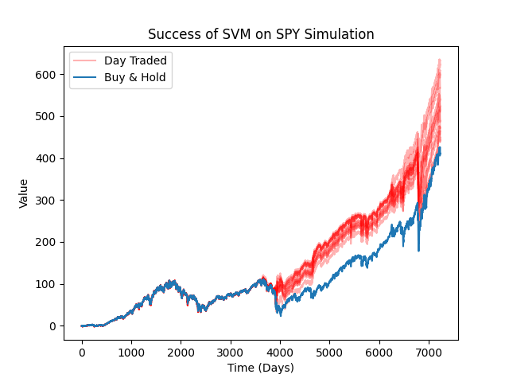
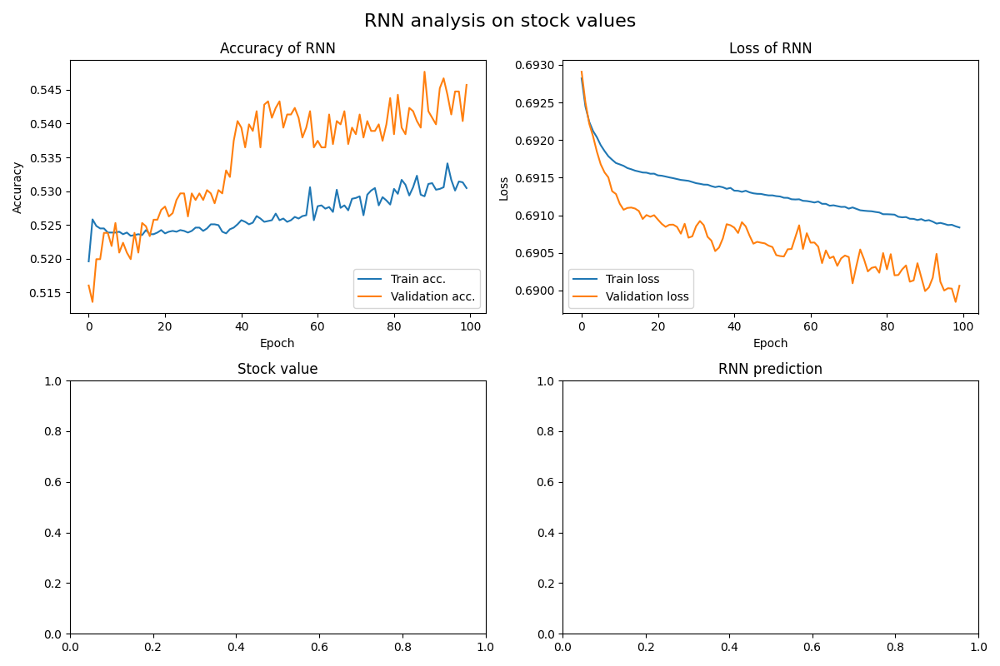
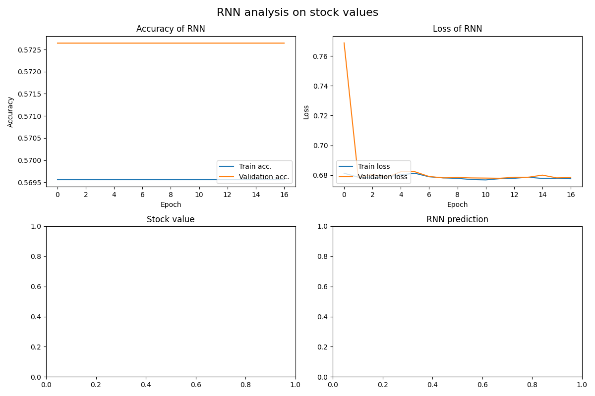

# Predicting Market Value
This project attempts to predict the returns of stocks with respect to their previous returns and various technical indicators.

### Requirements
* run in a venv
    * `virtualenv .venv; deactivate &> /dev/null; source ./.venv/bin/activate;`
* install all requirements
    * `pip install -r requirements.txt`

### Model Selection

- SVM
- RNN

# SVM

### Architecture

An SVM with a rbf kernel is used.

`model = svm.SVC(kernel="rbf", C = 1000, gamma = 1)`

### Dataset

Various stock tickers are train the model one at a time.

### Graphs

# RNN

### Architecture

Model: "sequential"

|    Layer (type)          |     Output Shape      |    Param    |
|--------------------------|-----------------------|-------------|
|    lstm (LSTM)           |    (None, 50, 128)    |    73728    |  
|    bidirectional-lstm    |    (None, 50, 64)     |    41216    |
|    dense (Dense)         |    (None, 50, 64)     |    4160     |
|    dense_1 (Dense)       |    (None, 50, 16)     |    1040     |
|    dense_2 (Dense)       |    (None, 50, 1)      |    17       |

* Total params: 120,161
* Trainable params: 120,161
* Non-trainable params: 0

### Dataset
Historical data was pulled from yahoo finance on 502 different stock tickers from the S&P 500

* x shape: (55203, 50, 15)
* y shape: (55203, 50, 1)

### RNN trained on returns AAPL (54% accuracy)

### RNN trained on technical indicators SNP500 (57% accuracy)

