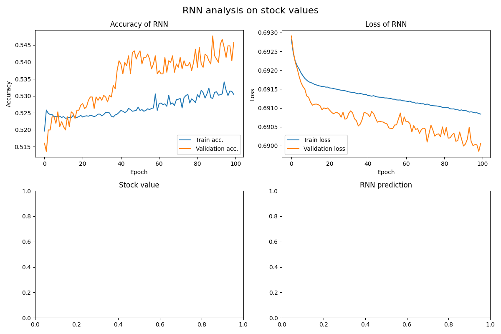

# RNN

## Requirements
* work in a venv
* `pip install -r requirements.txt`

## Architecture

Model: "sequential"

|    Layer (type)          |     Output Shape      |    Param    |
|--------------------------|-----------------------|-------------|
|    lstm (LSTM)           |    (None, 50, 128)    |    73728    |  
|    bidirectional-lstm    |    (None, 50, 64)     |    41216    |
|    dense (Dense)         |    (None, 50, 64)     |    4160     |
|    dense_1 (Dense)       |    (None, 50, 16)     |    1040     |
|    dense_2 (Dense)       |    (None, 50, 1)      |    17       |

* Total params: 120,161
* Trainable params: 120,161
* Non-trainable params: 0

## Dataset
historical data was pulled from yahoo finance on 502 different stock tickers from the S&P 500

x shape: (55203, 50, 15)
y shape: (55203, 50, 1)

### RNN trained on returns (54% accuracy)

